<p align="center">
    
    <br>
    <br>
    <strong>Flutter Demon</strong>
    <br>
    <br>
    <em>A blazingly fast TUI for Flutter development</em>
    <br>
    <br>
    <a href="https://github.com/edTheGuy00/flutter-demon/releases">
        </a>
    <br>
    <a href="https://github.com/edTheGuy00/flutter-demon/actions">
        </a>
    <a href="https://github.com/edTheGuy00/flutter-demon/blob/main/LICENSE">
        </a>
</p>

<h4 align="center">
  <a href="docs/ARCHITECTURE.md">Architecture</a> |
  <a href="docs/KEYBINDINGS.md">Keybindings</a> |
  <a href="docs/CONFIGURATION.md">Configuration</a> |
  <a href="#installation">Installation</a> |
  <a href="#usage">Usage</a>
</h4>

---

😈🔥 **Flutter Demon** is a high-performance terminal user interface for Flutter development. Run your Flutter apps, view logs in real-time, hot reload on file changes, and manage multiple device sessions — all from the comfort of your terminal!

## Installation

Coming soon: pre-built binaries for Windows, macOS, and Linux!


## Features

### 🔍 Smart Project Discovery

Flutter Demon intelligently detects different Flutter project types and finds runnable apps:

| Type | Runnable? | Behavior |
|------|-----------|----------|
| **Flutter App** | ✅ Yes | Runs directly |
| **Flutter Plugin** | ❌ No | Auto-discovers `example/` |
| **Flutter Package** | ❌ No | Skipped (no platform dirs) |
| **Dart Package** | ❌ No | Skipped (no Flutter SDK) |

### 📱 Multi-Device Sessions

Run your app on up to 9 devices simultaneously! Switch between sessions with number keys or Tab.

### ⚡ Auto Hot Reload

File watcher monitors your `lib/` directory and triggers hot reload automatically when you save — with smart debouncing to avoid reload spam.

### 🔎 Log Filtering & Search

Powerful log management to find what you need:

- **Filter by level**: Show only errors, warnings, info, or debug messages
- **Filter by source**: Focus on app, daemon, Flutter, or watcher logs
- **Regex search**: Find patterns with `/` (vim-style), navigate with `n`/`N`
- **Error navigation**: Jump between errors with `e`/`E`

### 🎨 Beautiful TUI

Clean, responsive terminal interface built with [ratatui](https://github.com/ratatui/ratatui):

- Scrollable log view with syntax highlighting
- Search match highlighting with current match indicator
- Session tabs for multi-device development
- Status bar with reload count and timing
- Device/emulator selection modal

## Usage

### Basic Usage

```bash
# From a Flutter app directory
cd /path/to/my_flutter_app
fdemon

# Or with an explicit path
fdemon /path/to/my_flutter_app
```

### Auto-Discovery Mode

Run from a workspace with multiple Flutter projects:

```bash
cd /path/to/workspace
fdemon
```

If multiple runnable projects are found, you'll see a selection menu:


### Working with Plugins

Flutter Demon automatically finds the `example/` app in plugin directories:

```bash
cd /path/to/my_plugin
fdemon

# Output:
# 📦 Detected Flutter plugin at: /path/to/my_plugin
#    Plugins cannot be run directly. Searching for runnable examples...
#
# ✅ Found Flutter project: /path/to/my_plugin/example
```

## Keyboard Controls

Flutter Demon provides extensive keyboard controls for efficient terminal-based development. For a complete reference of all keyboard bindings organized by mode and functionality, see **[KEYBINDINGS.md](docs/KEYBINDINGS.md)**.

### Quick Reference

| Key | Action |
|-----|--------|
| `q` / `Esc` | Quit |
| `r` / `R` | Hot reload / Hot restart |
| `d` | Open device selector |
| `c` | Clear logs |
| `1-9` | Switch to session 1-9 |
| `Tab` | Next/previous session |
| `j` / `k` | Scroll down/up (vim-style) |
| `f` / `F` | Cycle level/source filters |
| `/` | Search logs (vim-style) |
| `e` / `E` | Jump to next/previous error |
| `L` | Enter link highlight mode |

## Opening Files from Logs

Press `L` to enter **Link Highlight Mode**. All file references in the visible
viewport will be highlighted with shortcut badges (`[1]`, `[2]`, `[a]`, `[b]`, etc.).
Press the corresponding key to open that file in your editor. Press `Esc` or `L`
again to exit.

Files are opened in your configured editor. If running inside an IDE's integrated
terminal (VS Code, Cursor, Zed, IntelliJ), files open in that IDE instance automatically.

## Configuration

Flutter Demon is highly configurable to fit your development workflow. For complete documentation of all configuration options, see **[CONFIGURATION.md](docs/CONFIGURATION.md)**.

### Quick Start

Flutter Demon supports three configuration files:

- **`.fdemon/config.toml`** - Global settings (behavior, watcher, UI, editor)
- **`.fdemon/launch.toml`** - Launch configurations for different environments
- **`.vscode/launch.json`** - Automatic VSCode compatibility (read-only)

### Example: Global Settings

```toml
[behavior]
auto_start = false
confirm_quit = true

[watcher]
paths = ["lib"]
debounce_ms = 500
auto_reload = true

[editor]
command = ""  # Auto-detect from environment
```

### Example: Launch Configurations

```toml
[[configurations]]
name = "Development"
device = "iphone"
mode = "debug"
auto_start = true

[configurations.dart_defines]
API_URL = "https://dev.api.example.com"
```

> [!TIP]
> Flutter Demon automatically imports existing `.vscode/launch.json` configurations - no migration needed!

See the full [Configuration Reference](docs/CONFIGURATION.md) for all available options and examples.

## Architecture

For developers interested in contributing or understanding the internals, see the [Architecture Documentation](docs/ARCHITECTURE.md).


## Contributing

Contributions are welcome! Please feel free to submit a Pull Request.

```bash
# Build
cargo build

# Run tests
cargo test

# Format code
cargo fmt

# Run lints
cargo clippy
```

## Requirements

- **Rust** 1.70+ (for building)
- **Flutter SDK** in your PATH
- A terminal with Unicode support

## Development Process and Workflow

Flutter Demon was built using **[Claude Code](https://claude.ai/code)** with a structured AI-assisted workflow. It follows a structured development process that ensures high code quality through distinct phases. Each feature goes through planning, phased implementation, testing, and review:

```mermaid
flowchart TB
    Research["🔍 Research"] --> Plan["📋 Plan"]
    Plan --> Breakdown["📑 Break into Phases"]
    Breakdown --> Phase1["Phase 1"]
    Breakdown --> Phase2["Phase 2"]
    Breakdown --> PhaseN["Phase N"]

    Phase1 --> Tasks1["📝 Break into Tasks"]
    Tasks1 --> Task1A["Task 1"]
    Tasks1 --> Task1B["Task 2"]
    Tasks1 --> Task1C["Task N"]

    Task1A --> Impl1A["⚙️ Implement"]
    Task1B --> Impl1B["⚙️ Implement"]
    Task1C --> Impl1C["⚙️ Implement"]

    Impl1A --> PhaseTest1["🧪 Test Phase"]
    Impl1B --> PhaseTest1
    Impl1C --> PhaseTest1

    PhaseTest1 --> PhaseReview1["🔎 Review Phase"]
    PhaseReview1 -->|"✅ Pass"| Phase2
    PhaseReview1 -->|"❌ Issues"| Task1A

    Phase2 --> NextPhase["Continue..."]
    PhaseN --> FinalReview["🔎 Final Review"]
    FinalReview -->|"✅ Approved"| Done["✅ Done"]
    FinalReview -->|"❌ Needs Work"| PhaseN

    style Research fill:#e1f5ff
    style Plan fill:#fff4e1
    style Breakdown fill:#fff4e1
    style PhaseTest1 fill:#e8f5e9
    style PhaseReview1 fill:#f3e5f5
    style FinalReview fill:#f3e5f5
    style Done fill:#c8e6c9
```



| Phase | Description |
|-------|-------------|
| **Research** | Gather information on APIs, libraries, and best practices |
| **Plan** | Design features, document architecture, identify affected modules |
| **Break into Phases** | Divide feature into logical implementation phases with dependencies |
| **Break into Tasks** | Decompose each phase into concrete, testable tasks (3-6h each) |
| **Implement** | Execute individual tasks following architectural guidelines |
| **Test Phase** | After all phase tasks complete, run full test suite and verify integration |
| **Review Phase** | Validate architecture, code quality, logic, and risks for the phase |
| **Final Review** | Comprehensive review after all phases complete |

### Workflow Artifacts

Complete AI-assisted development history is maintained in [workflow](./workflow/) with the following structure:

```
workflow/
├── plans/
│   ├── features/          # Feature plans with phases and tasks
│   └── bugs/              # Bug reports and fix tasks
└── reviews/
    ├── features/          # Feature implementation reviews
    └── bugs/              # Bug fix reviews
```

Each task file includes a **Completion Summary** with:
- Files modified and changes made
- Notable decisions and tradeoffs
- Testing performed and results
- Risks and limitations identified

This transparent development process demonstrates how AI can augment software development while maintaining high code quality, comprehensive testing, and thorough documentation.

## Contributing

Contributions are welcome! Flutter Demon is licensed under BSL-1.1, which allows contributions while protecting the project's commercial interests.

By contributing, you agree that your contributions will be licensed under the same BSL-1.1 license (converting to AGPL-3.0 after 4 years). You retain copyright to your contributions but grant perpetual rights for use in the project.

Please read [CONTRIBUTING.md](CONTRIBUTING.md) for:
- Contribution guidelines and workflow
- Code quality standards
- Testing requirements
- License implications for contributors

### Quick Start

```bash
# Build
cargo build

# Run tests
cargo test

# Format code
cargo fmt

# Run lints
cargo clippy
```

For questions or discussions, open an issue or start a discussion on GitHub.

## License

Licensed under the [Business Source License 1.1](LICENSE).

The BSL 1.1 allows you to use Flutter Demon freely for any purpose, including production use, except for providing a commercial hosted/managed Flutter development service. After four years from each release, the license automatically converts to AGPL-3.0.

---

<p align="center">
    Made with 🔥 for Flutter developers
</p>
