<p align="center">
    
    <br>
    <br>
    <strong>Flutter Demon</strong>
    <br>
    <em>A blazingly fast TUI for Flutter development</em>
    <br>
    <br>
    <a href="https://github.com/edTheGuy00/fdemon/releases">
        </a>
    <a href="https://github.com/edTheGuy00/fdemon/actions">
        </a>
    <a href="https://github.com/edTheGuy00/fdemon/blob/main/LICENSE">
        </a>
    <br>
    <br>
    <a href="https://fdemon.dev">Website</a> &middot;
    <a href="https://fdemon.dev/docs">Documentation</a> &middot;
    <a href="https://fdemon.dev/docs/keybindings">Keybindings</a> &middot;
    <a href="https://fdemon.dev/docs/configuration">Configuration</a>
</p>

---

**Flutter Demon** (`fdemon`) is a high-performance terminal UI for Flutter development. Run apps, view logs in real-time, hot reload on file changes, and manage multiple device sessions — all from your terminal.

<p align="center">
    
</p>

## Installation

```bash
curl -fsSL https://raw.githubusercontent.com/edTheGuy00/fdemon/main/install.sh | bash
```

This downloads the latest release binary for your platform and installs it to `$HOME/.local/bin`.

See the [installation guide](https://fdemon.dev/docs/installation) for version-specific installs, custom directories, Windows, and building from source.

## Features

- **Real-time log viewing** with level/source filtering, regex search, and error navigation
- **Auto hot reload** on file save with smart debouncing
- **Multi-device sessions** — run on up to 9 devices simultaneously
- **Built-in DevTools** — widget inspector, performance monitor, network monitor
- **New Session Dialog** — device selection, launch configs, dart defines
- **Link Highlight Mode** — open files from log traces directly in your editor
- **Smart project discovery** — auto-detects Flutter apps, plugins, and workspaces

## Quick Start

```bash
cd /path/to/my_flutter_app
fdemon
```

Select a device, configure launch settings, and press `Enter` to launch.

<p align="center">
    
</p>

## DevTools

Press `d` to enter DevTools mode. Three panels are available:

| Key | Panel | Description |
|-----|-------|-------------|
| `i` | **Widget Inspector** | Browse the widget tree, view layout details and source locations |
| `p` | **Performance** | Real-time FPS, memory usage, jank detection, allocation table |
| `n` | **Network** | HTTP request capture, detail tabs, filtering, recording controls |

<p align="center">
    
    &nbsp;&nbsp;
    
</p>

Debug overlays (`Ctrl+r` repaint rainbow, `Ctrl+p` performance, `Ctrl+d` debug paint) and browser DevTools (`b`) are also available.

## Key Bindings

| Key | Action |
|-----|--------|
| `r` / `R` | Hot reload / Hot restart |
| `d` | Enter DevTools |
| `+` | New session |
| `1-9` / `Tab` | Switch session |
| `f` / `F` | Cycle level/source filter |
| `/` | Search logs |
| `e` / `E` | Next/previous error |
| `L` | Link highlight mode |
| `q` `q` | Quit |

Full reference: [fdemon.dev/docs/keybindings](https://fdemon.dev/docs/keybindings)

## Configuration

Flutter Demon works out-of-the-box with sensible defaults. Optionally configure via:

- **`.fdemon/config.toml`** — Behavior, watcher, UI, editor settings
- **`.fdemon/launch.toml`** — Launch configurations (device, mode, flavor, dart defines)
- **`.vscode/launch.json`** — Auto-imported (read-only)

Full reference: [fdemon.dev/docs/configuration](https://fdemon.dev/docs/configuration)

## Requirements

- **Flutter SDK** in your PATH
- A terminal with Unicode support

## Development Process and Workflow

Flutter Demon was built using **[Claude Code](https://claude.ai/code)** with a structured AI-assisted workflow. It follows a structured development process that ensures high code quality through distinct phases. Each feature goes through planning, phased implementation, testing, and review:

```mermaid
flowchart TB
    Research["🔍 Research"] --> Plan["📋 Plan"]
    Plan --> Breakdown["📑 Break into Phases"]
    Breakdown --> Phase1["Phase 1"]
    Breakdown --> Phase2["Phase 2"]
    Breakdown --> PhaseN["Phase N"]

    Phase1 --> Tasks1["📝 Break into Tasks"]
    Tasks1 --> Task1A["Task 1"]
    Tasks1 --> Task1B["Task 2"]
    Tasks1 --> Task1C["Task N"]

    Task1A --> Impl1A["⚙️ Implement"]
    Task1B --> Impl1B["⚙️ Implement"]
    Task1C --> Impl1C["⚙️ Implement"]

    Impl1A --> PhaseTest1["🧪 Test Phase"]
    Impl1B --> PhaseTest1
    Impl1C --> PhaseTest1

    PhaseTest1 --> PhaseReview1["🔎 Review Phase"]
    PhaseReview1 -->|"✅ Pass"| Phase2
    PhaseReview1 -->|"❌ Issues"| Task1A

    Phase2 --> NextPhase["Continue..."]
    PhaseN --> FinalReview["🔎 Final Review"]
    FinalReview -->|"✅ Approved"| Done["✅ Done"]
    FinalReview -->|"❌ Needs Work"| PhaseN

    style Research fill:#e1f5ff
    style Plan fill:#fff4e1
    style Breakdown fill:#fff4e1
    style PhaseTest1 fill:#e8f5e9
    style PhaseReview1 fill:#f3e5f5
    style FinalReview fill:#f3e5f5
    style Done fill:#c8e6c9
```



| Phase | Description |
|-------|-------------|
| **Research** | Gather information on APIs, libraries, and best practices |
| **Plan** | Design features, document architecture, identify affected modules |
| **Break into Phases** | Divide feature into logical implementation phases with dependencies |
| **Break into Tasks** | Decompose each phase into concrete, testable tasks (3-6h each) |
| **Implement** | Execute individual tasks following architectural guidelines |
| **Test Phase** | After all phase tasks complete, run full test suite and verify integration |
| **Review Phase** | Validate architecture, code quality, logic, and risks for the phase |
| **Final Review** | Comprehensive review after all phases complete |

### Workflow Artifacts

Complete AI-assisted development history is maintained in [workflow](./workflow/) with the following structure:

```
workflow/
├── plans/
│   ├── features/          # Feature plans with phases and tasks
│   └── bugs/              # Bug reports and fix tasks
└── reviews/
    ├── features/          # Feature implementation reviews
    └── bugs/              # Bug fix reviews
```

Each task file includes a **Completion Summary** with:
- Files modified and changes made
- Notable decisions and tradeoffs
- Testing performed and results
- Risks and limitations identified

This transparent development process demonstrates how AI can augment software development while maintaining high code quality, comprehensive testing, and thorough documentation.

## Contributing

Contributions are welcome! See [CONTRIBUTING.md](CONTRIBUTING.md) for guidelines.

```bash
cargo build && cargo test && cargo clippy
```

## License

[Business Source License 1.1](LICENSE) — free for all use except providing a commercial hosted Flutter development service. Converts to AGPL-3.0 after four years.

---

<p align="center">
    Made with 🔥 for Flutter developers
</p>
